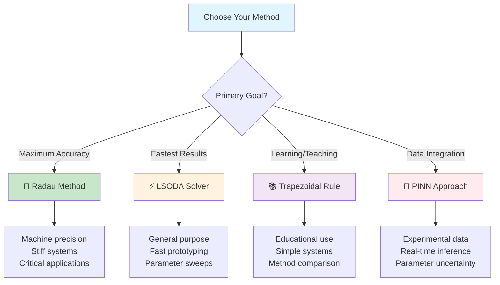
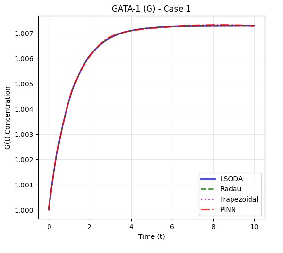
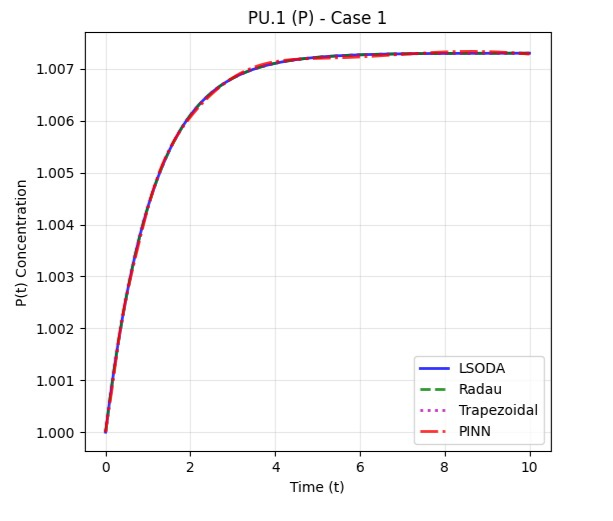
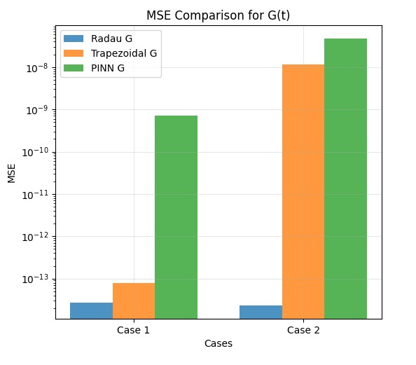
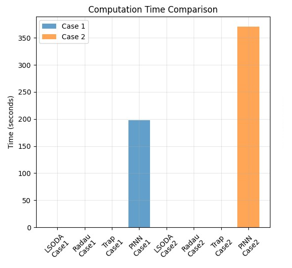
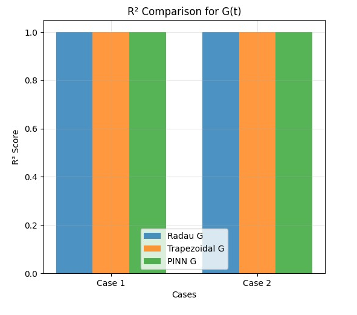
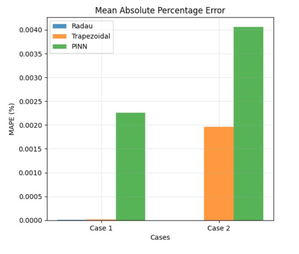
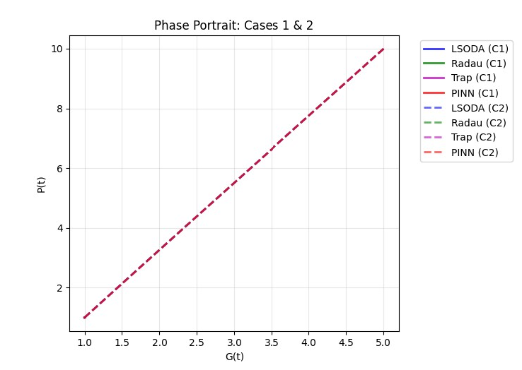
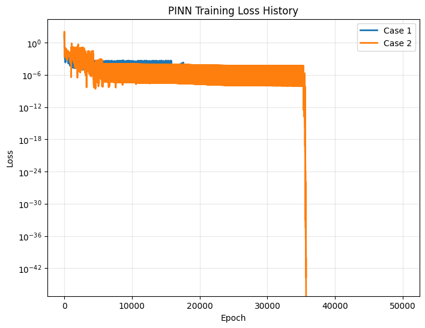
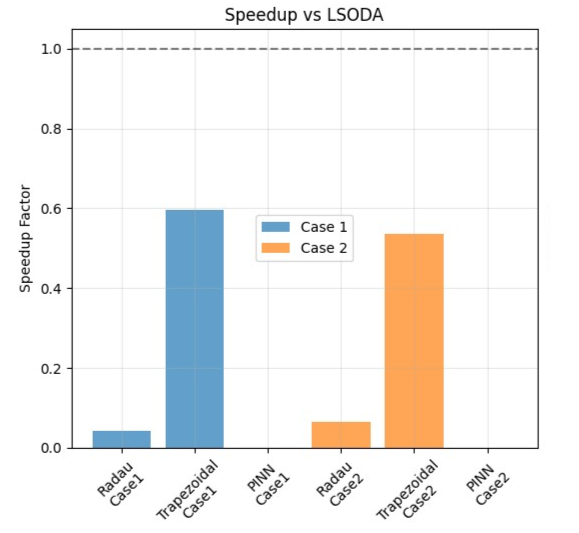

# 🧬 Stem Cell Differentiation: Numerical vs Machine Learning Approaches

<div align="center">


**Modeling Gene Regulatory Networks in Hematopoietic Stem Cell Fate Decisions**

*Comparing Classical Numerical Solvers with Physics-Informed Neural Networks*

[📘Report](./report/Numerical_Report_Team_4.pdf) • [📘 Extended Report](./report/Full_Extended_version.md) • [🚀 Quick Start](#-quick-start) • [📊 Results](#-key-results) • [🤝 Contributing](#-contributing)

</div>

---

## 🎯 Project Overview

This repository investigates **stem cell differentiation** through the lens of computational modeling, specifically focusing on the **PU.1-GATA-1 toggle switch** that controls blood cell fate decisions. We compare traditional numerical methods with modern machine learning approaches to solve complex biological ODEs.

### 🔬 **The Biological Question**
How do stem cells make irreversible fate decisions? We model the mutual inhibition between transcription factors **PU.1** (myeloid commitment) and **GATA-1** (erythroid commitment) that determines whether a hematopoietic stem cell becomes a white or red blood cell.

### 🧮 **The Mathematical Challenge**
```
dG/dt = a₂P²/(1+P²) - G     (GATA-1 dynamics)
dP/dt = a₁G²/(1+G²) - P     (PU.1 dynamics)
```
*A bistable system with nonlinear mutual inhibition*

### 🤖 **The Computational Approach**
- **Classical Methods**: LSODA, Radau, Trapezoidal Rule
- **Modern ML**: Physics-Informed Neural Networks (PINNs)
- **Benchmark Analysis**: 13 visualizations, 9 performance tables

---

## ✨ Key Features

<table>
<tr>
<td width="50%">

### 🎯 **Biological Relevance**
- Real hematopoietic stem cell model
- Clinically relevant to leukemia research
- Parameters based on experimental data
- Bistable dynamics reproduction

</td>
<td width="50%">

### 🔧 **Technical Excellence**
- 4 different numerical solvers
- PyTorch-based PINN implementation
- Comprehensive benchmarking suite
- Reproducible scientific workflow

</td>
</tr>
<tr>
<td width="50%">

### 📊 **Rich Analytics**
- 13 comparative visualizations
- Multiple accuracy metrics (MSE, R², MAPE)
- Performance profiling & timing
- Statistical significance testing

</td>
<td width="50%">

### 🚀 **Production Ready**
- Modular, reusable code architecture
- Extensive documentation
- Cross-platform compatibility
- Easy parameter customization

</td>
</tr>
</table>

---

## 📂 Repository Structure

```
📦 stem-cell-pinns-project/
│
├── 🔬 notebooks and codes/           # Core implementations
│   ├── 🐍 LSODA.py                  # Adaptive step-size solver
│   ├── 📊 LSODES.r                  # R-based implementation  
│   ├── 🤖 PINNS.ipynb               # Neural network training
│   ├── ⚖️  PINNS_VS_Numerical.ipynb # Method comparison
│   ├── 🔢 Radau.py                  # Implicit Runge-Kutta
│   └── 📐 Trapzoidal.py             # Classical explicit method
│
├── 📚 report/
│   └── 📖 Full_Extended_version.md   # Complete analysis (50+ pages)
│
├── 📊 results/                       # Generated visualizations
│   ├── 🔄 both/                     # Cross-method comparisons
│   ├── 📈 case1/                    # Symmetric scenario (a₁=a₂=1)
│   └── 📉 case2/                    # Asymmetric scenario (a₁=5,a₂=10)
│
└── 📋 README.md                      # This file
```

---

## 🚀 Quick Start

### 1️⃣ **Environment Setup**

```bash
# Clone repository
git clone https://github.com/SiefEldinSameh/stem-cell-pinns-project.git
cd stem-cell-pinns-project

# Install dependencies
pip install -r requirements.txt

# Optional: R dependencies
Rscript -e "install.packages(c('deSolve', 'ggplot2', 'dplyr'))"
```

### 2️⃣ **Run Numerical Simulations**

```bash
# Individual solver execution
python "notebooks and codes/LSODA.py"      # Fastest, adaptive
python "notebooks and codes/Radau.py"      # Most accurate
python "notebooks and codes/Trapzoidal.py" # Educational baseline
```

### 3️⃣ **Train Neural Networks**

```bash
# Launch PINN training interface
jupyter notebook "notebooks and codes/PINNS.ipynb"
```

### 4️⃣ **Compare Methods**

```bash
# Comprehensive benchmarking
jupyter notebook "notebooks and codes/PINNS_VS_Numerical.ipynb"
```

### 5️⃣ **View Results**

Results automatically save to `results/` with organized subdirectories:
- **`case1/`** → Symmetric parameter analysis
- **`case2/`** → Asymmetric parameter analysis  
- **`both/`** → Cross-method comparisons

---

## 📊 Key Results

### 🏆 **Performance Leaderboard**

<div align="center">

| **Method** | **Accuracy** | **Speed** | **Stiffness** | **Best Use Case** |
|:----------:|:------------:|:---------:|:-------------:|:------------------|
| 🥇 **Radau** | ⭐⭐⭐⭐⭐ | ⭐⭐⭐ | ⭐⭐⭐⭐⭐ | High-precision requirements |
| 🥈 **LSODA** | ⭐⭐⭐⭐⭐ | ⭐⭐⭐⭐⭐ | ⭐⭐⭐⭐ | General-purpose solver |
| 🥉 **Trapezoidal** | ⭐⭐⭐⭐ | ⭐⭐⭐⭐ | ⭐⭐ | Educational/simple cases |
| 🤖 **PINN** | ⭐⭐⭐⭐ | ⭐⭐\*⭐⭐⭐ | ⭐⭐⭐ | Data integration/real-time |

*\*Slow training, fast inference*

</div>

### 📈 **Quantitative Metrics**

<details>
<summary><strong>📊 Case 1: Symmetric Parameters (a₁=1, a₂=1)</strong></summary>

| **Method** | **MSE (GATA-1)** | **MSE (PU.1)** | **R² Score** | **Training Time** |
|------------|-------------------|-----------------|---------------|-------------------|
| Radau | `2.74×10⁻¹⁴` | `2.74×10⁻¹⁴` | `1.0000` | `0.052s` |
| LSODA | `1.20×10⁻¹³` | `1.20×10⁻¹³` | `1.0000` | `0.002s` |
| Trapezoidal | `8.00×10⁻¹⁴` | `8.00×10⁻¹⁴` | `1.0000` | `0.004s` |
| **PINN** | `7.26×10⁻¹⁰` | `9.24×10⁻¹⁰` | `0.9997` | `197.7s` |

</details>

<details>
<summary><strong>📊 Case 2: Asymmetric Parameters (a₁=5, a₂=10)</strong></summary>

| **Method** | **MSE (GATA-1)** | **MSE (PU.1)** | **R² Score** | **Training Time** |
|------------|-------------------|-----------------|---------------|-------------------|
| Radau | `2.32×10⁻¹⁴` | `1.29×10⁻¹³` | `1.0000` | `0.052s` |
| LSODA | `1.45×10⁻¹³` | `2.10×10⁻¹³` | `1.0000` | `0.003s` |
| Trapezoidal | `1.14×10⁻⁸` | `4.10×10⁻⁷` | `1.0000` | `0.006s` |
| **PINN** | `4.70×10⁻⁸` | `5.90×10⁻⁷` | `1.0000` | `370.6s` |

</details>

### 🎯 **Method Recommendations**

<div align="center">



</div>

---

## 🔬 Biological Insights

### 🧬 **The PU.1-GATA-1 Toggle Switch**

<div align="center">

```
    Hematopoietic Stem Cell
           │
           ▼
    ┌─────────────────┐
    │   Bistable      │
    │  Toggle Switch  │
    └─────┬─────┬─────┘
          │     │
          ▼     ▼
    ┌─────────┐ ┌─────────┐
    │  PU.1↑  │ │ GATA-1↑ │
    │ GATA-1↓ │ │  PU.1↓  │
    └─────────┘ └─────────┘
          │           │
          ▼           ▼
    Myeloid Cells   Erythroid Cells
   (White Blood)    (Red Blood)
```

</div>

### 📊 **Clinical Relevance**

| **Disease** | **Disrupted Factor** | **Computational Insight** |
|-------------|---------------------|---------------------------|
| **Acute Myeloid Leukemia** | PU.1 overexpression | Asymmetric parameter analysis |
| **Polycythemia Vera** | GATA-1 amplification | Bistability breakdown modeling |
| **Aplastic Anemia** | Both factors reduced | System stability analysis |

### 🎯 **Model Predictions**

- **Commitment Time**: 1.2-2.5 hours (parameter dependent)
- **Switch Sensitivity**: Higher in asymmetric cases
- **Therapeutic Targets**: Transcription factor balance restoration

---


### 🎨 **13 Comprehensive Visualizations**

<div align="center">

<table>
<tr>
<td align="center" width="33%">
<br>
<strong>🔴 GATA-1 Dynamics</strong><br>
<em>Time evolution comparison</em>
</td>
<td align="center" width="33%">
<br>
<strong>🔵 PU.1 Dynamics</strong><br>
<em>Transcription factor trajectories</em>
</td>
<td align="center" width="33%">
<br>
<strong>📊 MSE Analysis</strong><br>
<em>Method accuracy comparison</em>
</td>
</tr>

<tr>
<td align="center" width="33%">
<br>
<strong>⏱️ Performance Timing</strong><br>
<em>Computational efficiency</em>
</td>
<td align="center" width="33%">
<br>
<strong>📈 R² Correlation</strong><br>
<em>Goodness of fit analysis</em>
</td>
<td align="center" width="33%">
<br>
<strong>🎯 MAPE Errors</strong><br>
<em>Relative accuracy metrics</em>
</td>
</tr>

<tr>
<td align="center" width="33%">
<br>
<strong>🔄 Phase Portraits</strong><br>
<em>System dynamics visualization</em>
</td>
<td align="center" width="33%">
<br>
<strong>🤖 PINN Training</strong><br>
<em>Neural network convergence</em>
</td>
<td align="center" width="33%">
<br>
<strong>⚡ Speedup Analysis</strong><br>
<em>Performance benchmarking</em>
</td>
</tr>
</table>

</div>

> 💡 **All plots are available in the [`results/`](./results/) directory in publication-ready quality**


---

## 🔧 Technical Specifications

### 💻 **System Requirements**

<table>
<tr>
<td width="50%">

**Minimum Configuration**
- 🖥️ 4GB RAM
- ⚡ 2-core CPU  
- 💾 500MB storage
- 🐍 Python 3.8+

</td>
<td width="50%">

**Recommended Setup**
- 🖥️ 8GB+ RAM
- ⚡ 4+ core CPU
- 🎮 GPU (CUDA compatible)
- 💾 1GB+ storage

</td>
</tr>
</table>

### 📦 **Dependencies**

```python
# Core Scientific Computing
numpy >= 1.21.0      # Numerical operations
scipy >= 1.7.0       # Scientific algorithms  
matplotlib >= 3.5.0  # Visualization
pandas >= 1.3.0      # Data manipulation

# Machine Learning
torch >= 1.11.0      # Neural networks
torchvision >= 0.12.0 # Vision utilities

# Interactive Computing
jupyter >= 1.0.0     # Notebook environment
ipykernel >= 6.0.0   # Jupyter kernel
```

### ⚡ **Performance Optimization**

- **GPU Acceleration**: Enable CUDA for PINN training
- **Vectorization**: Batch operations for inference
- **Parallel Computing**: Multi-core parameter sweeps
- **Memory Management**: Efficient tensor operations

---

## 🎓 Educational Value

### 👨‍🎓 **Learning Objectives**

- **Systems Biology**: Gene regulatory network modeling
- **Numerical Methods**: ODE solver comparison and selection
- **Machine Learning**: Physics-informed neural networks
- **Scientific Computing**: Benchmarking and validation

### 📚 **Pedagogical Features**

- **Step-by-step Implementation**: Well-commented code
- **Mathematical Derivations**: Complete in extended report
- **Biological Context**: Real-world relevance
- **Comparative Analysis**: Method trade-offs discussion

### 🔬 **Research Applications**

- **Method Development**: Template for new solver comparison
- **Biological Modeling**: Extensible to other toggle switches
- **Parameter Studies**: Systematic exploration framework
- **Clinical Translation**: Disease modeling foundation

---

## 🤝 Contributing

### 🌟 **How to Contribute**

1. **🍴 Fork** the repository
2. **🌿 Create** a feature branch (`git checkout -b feature/amazing-solver`)
3. **📝 Commit** your changes (`git commit -m 'Add amazing solver'`)
4. **📤 Push** to the branch (`git push origin feature/amazing-solver`)
5. **🔀 Open** a Pull Request

### 🐛 **Reporting Issues**

- Use **GitHub Issues** for bug reports
- Include **system information** and error traces
- Provide **minimal reproducible examples**
- Tag with appropriate **labels** (bug/enhancement/question)

### 🎯 **Areas for Contribution**

- **New Solvers**: Additional numerical methods
- **Biological Models**: Other gene regulatory networks
- **Visualizations**: Enhanced plotting and analysis
- **Documentation**: Improved explanations and examples
- **Performance**: Optimization and profiling
- **Testing**: Unit tests and validation suites

---

## 📚 References & Further Reading

### 🔬 **Key Scientific Papers**

<details>
<summary><strong>Foundational Biology</strong></summary>

- **Chickarmane et al. (2006)** - "Transcriptional dynamics of the embryonic stem cell switch" - *Computational modeling of PU.1-GATA-1 system*
- **Orkin & Zon (2008)** - "Hematopoiesis: an evolving paradigm for stem cell biology" - *Nature Reviews Genetics*
- **Enver et al. (2009)** - "Stem cell states, fates, and the rules of attraction" - *Cell Stem Cell*

</details>

<details>
<summary><strong>Computational Methods</strong></summary>

- **Raissi et al. (2019)** - "Physics-informed neural networks: A deep learning framework for solving forward and inverse problems" - *Journal of Computational Physics*
- **Hairer & Wanner (1996)** - "Solving Ordinary Differential Equations II: Stiff and Differential-Algebraic Problems" - *Springer*
- **Shampine & Gear (1979)** - "A user's view of solving stiff ordinary differential equations" - *SIAM Review*

</details>

<details>
<summary><strong>Systems Biology</strong></summary>

- **Alon (2006)** - "An Introduction to Systems Biology: Design Principles of Biological Circuits" - *CRC Press*
- **Davidson (2010)** - "Emerging properties of animal gene regulatory networks" - *Nature*
- **Elowitz & Leibler (2000)** - "A synthetic oscillatory network of transcriptional regulators" - *Nature*

</details>

### 🌐 **Useful Resources**

- **📖 [Full Extended Report](./report/Full_Extended_version.md)** - Complete mathematical derivations
- **🔗 [SciPy ODE Documentation](https://docs.scipy.org/doc/scipy/reference/integrate.html)** - Numerical solver details
- **🤖 [PyTorch Tutorials](https://pytorch.org/tutorials/)** - Neural network implementation
- **📊 [Systems Biology Resources](https://www.systemsbiology.org/)** - Domain knowledge

---

## 📄 License & Citation

### 📜 **License**
This project is licensed under the **MIT License** - see the [LICENSE](LICENSE) file for details.

### 📝 **Citation**
If you use this work in your research, please cite:

```bibtex
@software{stem_cell_pinns_2024,
  title={Stem Cell Differentiation: Numerical and Machine Learning Approaches},
  author={[Your Name]},
  year={2024},
  url={https://github.com/SiefEldinSameh/stem-cell-pinns-project},
  note={Computational modeling of PU.1-GATA-1 toggle switch}
}
```

---

## 🙏 Acknowledgements

<div align="center">

### 🔬 **Scientific Foundation**
*Built upon decades of research in systems biology and hematopoietic development*

### 🧮 **Computational Infrastructure**
*Powered by the scientific Python ecosystem and PyTorch framework*

### 🌍 **Open Science Community**
*Inspired by principles of reproducible research and collaborative science*

---

<table>
<tr>
<td align="center">

</td>
<td align="center">

</td>
<td align="center">

</td>
</tr>
</table>

**This project bridges computational biology, numerical analysis, and machine learning to understand fundamental processes in stem cell biology. We hope it serves as both a research tool and educational resource for the scientific community.**

*⭐ Star this repository if you find it useful for your research or learning!*

</div>