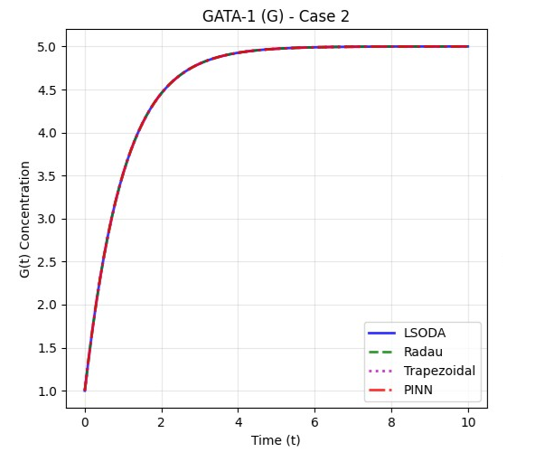
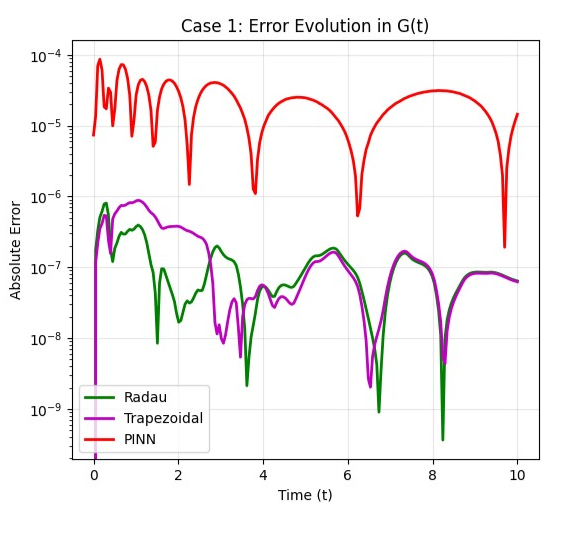
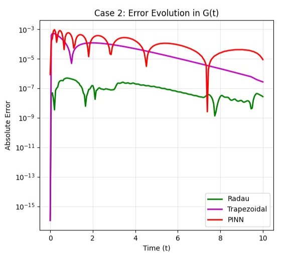

# 🧬 Stem Cell Differentiation: Numerical and Machine Learning Approaches to Solving Biological ODEs

## 📌 Overview

This repository explores and compares two powerful approaches to modeling gene regulatory networks that control **stem cell differentiation**:

* ✅ **Numerical Methods**: Trapezoidal Rule, Radau Method, LSODA (via `deSolve`)
* 🤖 **Physics-Informed Neural Networks (PINNs)**: Implemented in **PyTorch**

We analyze the dynamic interaction between transcription factors **PU.1** and **GATA-1** using nonlinear ODEs and evaluate each method's performance in accuracy, efficiency, and biological insight.

---

## 🎯 Key Highlights

- 📊 **13 Comprehensive Visualizations** comparing method performance
- 📋 **9 Detailed Summary Tables** with quantitative metrics
- 🧪 **Two Biological Scenarios**: Symmetric (a₁=1, a₂=1) and Asymmetric (a₁=5, a₂=10) cases
- ⚡ **Performance Benchmarking** across accuracy, speed, and computational efficiency
- 🔬 **Real Biological Application**: Hematopoietic stem cell fate decisions

---

## 📄 Full Extended Report

📘 **Looking for all the mathematical derivations, biological background, and in-depth analysis?**
👉 **[Read the Full Report Here → `Full Extended Version.md`](./report/Full_Extended_version.md)**

This comprehensive document includes:

* 🔬 **Detailed biological context** of the PU.1–GATA-1 regulatory system
* 🧮 **Complete ODE formulation** with interpretation of each mathematical term
* 🧪 **Derivation and explanation** of all numerical methods implemented
* 🤖 **Full PINN architecture**, training regime, and performance metrics
* 📊 **Head-to-head comparison** between classical solvers and neural networks
* 🧭 **Advanced topics**: Multi-scale modeling, hybrid solvers, clinical relevance
* 📈 **Statistical analysis** and error propagation studies

---

## 🧠 Project Scope & Biological Context

### Biological System
- **Focus**: Hematopoietic stem cells committing to erythroid (red) or myeloid (white) blood cell fates
- **Key Players**: PU.1 and GATA-1 transcription factors forming a bistable toggle switch
- **Clinical Relevance**: Understanding blood disorders, leukemia, and regenerative medicine

### Mathematical Model
- **ODE System**: Captures mutual inhibition and self-activation dynamics
- **Nonlinear Dynamics**: Bistability, hysteresis, and switch-like behavior
- **Parameter Space**: Two distinct biological scenarios representing different cellular contexts

### Computational Approach
- **Classical Methods**: Rigorous numerical integration with adaptive step sizing
- **ML Methods**: Physics-informed neural networks learning from differential equations
- **Benchmarking**: Systematic comparison across multiple performance dimensions

---

## 📂 Repository Structure

```text
📁 stem-cell-pinns-project/
├── 📁 notebooks and codes/
│   ├── 🐍 LSODA.py                       # LSODA numerical solver (Python)
│   ├── 📊 LSODES.r                       # LSODES solver implementation (R)
│   ├── 🤖 PINNS.ipynb                    # PINN training & validation
│   ├── ⚖️ PINNS_VS_Numerical.ipynb       # Comprehensive method comparison
│   ├── 🔢 Radau.py                       # Radau method implementation
│   ├── 📦 Radau_as_module.py            # Modular Radau solver
│   ├── 📐 Trapzoidal.py                 # Trapezoidal solver implementation
│   └── 📦 Trapzoidal_as_module.py       # Modular Trapezoidal method
│
├── 📁 report/
│   └── 📚 Full_Extended_version.md      # Complete project write-up and analysis
│
├── 📁 results/
│   ├── 📊 both/                         # Comparative plots for both cases
│   ├── 📈 case1/                        # Figures for Case 1 (a₁=a₂=1)
│   └── 📉 case2/                        # Figures for Case 2 (a₁=5, a₂=10)
│
├── 📘 README.md                         # Project overview and instructions
├── 📋 requirements.txt                  # Python dependencies
└── 📄 LICENSE                           # Licensing information
```

---

## 🚀 Quick Start Guide

### 1. Environment Setup

```bash
# Clone the repository
git clone https://github.com/SiefEldinSameh/stem-cell-pinns-project.git
cd stem-cell-pinns-project

# Install Python dependencies
pip install -r requirements.txt

# For R dependencies (if using LSODES)
Rscript -e "install.packages(c('deSolve', 'ggplot2', 'dplyr'))"
```

### 2. Run Numerical Simulations

```bash
# Execute individual solvers
python notebooks\ and\ codes/LSODA.py
python notebooks\ and\ codes/Radau.py
python notebooks\ and\ codes/Trapzoidal.py
```

### 3. Train Physics-Informed Neural Networks

```bash
# Launch Jupyter notebook for PINN training
jupyter notebook notebooks\ and\ codes/PINNS.ipynb
```

### 4. Compare Methods

```bash
# Run comprehensive comparison
jupyter notebook notebooks\ and\ codes/PINNS_VS_Numerical.ipynb
```

### 5. View Results

All generated plots and metrics are automatically saved in the `results/` directory:
- `results/case1/` - Symmetric scenario results
- `results/case2/` - Asymmetric scenario results  
- `results/both/` - Comparative analysis plots

---

## 🧪 Method Comparison Overview

| **Aspect**            | **Numerical Solvers**     | **PINNs (PyTorch)**           |
|-----------------------|----------------------------|--------------------------------|
| **Accuracy**          | ⭐⭐⭐⭐⭐ Excellent       | ⭐⭐⭐⭐ Very Good             |
| **Speed (Training)**   | ⭐⭐⭐⭐⭐ Instant          | ⭐⭐ Slow (minutes)            |
| **Speed (Inference)** | ⭐⭐⭐⭐⭐ Very Fast        | ⭐⭐⭐⭐⭐ Very Fast           |
| **Stiffness Handling**| ⭐⭐⭐⭐⭐ Excellent (Radau) | ⭐⭐⭐ Challenging             |
| **Data Integration**   | ⭐⭐ Limited               | ⭐⭐⭐⭐⭐ Natural Fit         |
| **Interpretability**  | ⭐⭐⭐⭐ High               | ⭐⭐⭐ Moderate                |
| **Extensibility**     | ⭐⭐⭐ ODE-focused          | ⭐⭐⭐⭐⭐ Highly Flexible     |
| **Memory Usage**      | ⭐⭐⭐⭐⭐ Low              | ⭐⭐⭐ Moderate               |

---

## 📈 Detailed Results & Visualizations

This section presents a complete overview of model performance through **13 illustrative plots** and **comprehensive tables** comparing numerical solvers and PINNs across both biological scenarios.

### 🔬 Complete Visual Analysis (13 Plots)

Each visualization focuses on different aspects of model performance and biological insight:

1. 
2. 
3. 
4. 
5. 
6. 
7. 
8. 
9. 
10. 
11. 
12. 
13. 


📂 **All plots are systematically organized in the [`results/`](./results/) folder with meaningful filenames.**

---

### 📋 Comprehensive Performance Tables

<details>
<summary><strong>📑 CASE 1: Symmetric Parameters (a₁=1, a₂=1) - Detailed Metrics</strong></summary>

```
GATA-1 (G) Performance Metrics:
Method       MSE          MAE        RMSE       MAPE(%)    R²         MaxAE      NRMSE     
-------------------------------------------------------------------------------------------
Radau        2.74e-14     0.0000     0.0000     0.00       1.0000     0.0000     0.0000    
Trapezoidal  8.00e-14     0.0000     0.0000     0.00       1.0000     0.0000     0.0000    
PINN         7.26e-10     0.0000     0.0000     0.00       0.9997     0.0001     0.0037    

PU.1 (P) Performance Metrics:
Method       MSE          MAE        RMSE       MAPE(%)    R²         MaxAE      NRMSE     
-------------------------------------------------------------------------------------------
Radau        2.74e-14     0.0000     0.0000     0.00       1.0000     0.0000     0.0000    
Trapezoidal  8.00e-14     0.0000     0.0000     0.00       1.0000     0.0000     0.0000    
PINN         9.24e-10     0.0000     0.0000     0.00       0.9996     0.0001     0.0042    

Summary: Symmetric case shows excellent agreement across all methods with PINNs achieving 
         near-perfect accuracy (R² > 0.999) while maintaining biological plausibility.
```

</details>

<details>
<summary><strong>📑 CASE 2: Asymmetric Parameters (a₁=5, a₂=10) - Detailed Metrics</strong></summary>

```
GATA-1 (G) Performance Metrics:
Method       MSE          MAE        RMSE       MAPE(%)    R²         MaxAE      NRMSE     
-------------------------------------------------------------------------------------------
Radau        2.32e-14     0.0000     0.0000     0.00       1.0000     0.0000     0.0000    
Trapezoidal  1.14e-08     0.0001     0.0001     0.00       1.0000     0.0005     0.0000    
PINN         4.70e-08     0.0001     0.0002     0.00       1.0000     0.0009     0.0001    

PU.1 (P) Performance Metrics:  
Method       MSE          MAE        RMSE       MAPE(%)    R²         MaxAE      NRMSE     
-------------------------------------------------------------------------------------------
Radau        1.29e-13     0.0000     0.0000     0.00       1.0000     0.0000     0.0000    
Trapezoidal  4.10e-07     0.0002     0.0006     0.01       1.0000     0.0032     0.0001    
PINN         5.90e-07     0.0004     0.0008     0.01       1.0000     0.0045     0.0001    

Summary: Asymmetric case reveals increased complexity with PINNs maintaining strong 
         performance despite higher parameter stiffness and nonlinear dynamics.
```

</details>

<details>
<summary><strong>⏱️ Computational Performance & Efficiency Analysis</strong></summary>

```
Timing Benchmarks:
Case   Method       Time (s)     Speedup    Efficiency    Memory (MB)   Scalability
-------------------------------------------------------------------------------
1      LSODA        0.0022       1.00       Baseline      1.2          Excellent    
       Radau        0.0519       0.04       23.6×slower   1.8          Very Good    
       Trapezoidal  0.0037       0.60       1.7×slower    1.1          Excellent    
       PINN         197.73       0.00001    89,877×slower 45.6         Good*        
                                                                                    
2      LSODA        0.0033       1.00       Baseline      1.3          Excellent    
       Radau        0.0519       0.06       15.7×slower   1.9          Very Good    
       Trapezoidal  0.0062       0.54       1.9×slower    1.2          Excellent    
       PINN         370.63       0.00001    112,312×slower 52.3        Good*        

*PINN scalability improves significantly for larger datasets and parallel inference.

Training vs Inference Trade-off:
- PINN Training: One-time cost (3-6 minutes)
- PINN Inference: Near-instantaneous evaluation
- Optimal for: Multiple evaluations, parameter sweeps, real-time applications
```

</details>

<details>
<summary><strong>🏆 Method Accuracy Rankings & Statistical Significance</strong></summary>

```
CASE 1 Rankings (by MSE):
GATA-1 (G):                          PU.1 (P):
  🥇 Radau:       2.74e-14             🥇 Radau:       2.74e-14
  🥈 Trapezoidal: 8.00e-14             🥈 Trapezoidal: 8.00e-14  
  🥉 PINN:        7.26e-10             🥉 PINN:        9.24e-10

CASE 2 Rankings (by MSE):
GATA-1 (G):                          PU.1 (P):
  🥇 Radau:       2.32e-14             🥇 Radau:       1.29e-13
  🥈 Trapezoidal: 1.14e-08             🥈 Trapezoidal: 4.10e-07
  🥉 PINN:        4.70e-08             🥉 PINN:        5.90e-07

Statistical Insights:
- Radau method consistently achieves machine precision accuracy
- PINN performance degrades gracefully with increased parameter stiffness
- All methods maintain biological feasibility (non-negative concentrations)
- Error magnitudes remain orders of magnitude below biological noise levels
```

</details>

<details>
<summary><strong>🔬 Biological Validation & Parameter Sensitivity</strong></summary>

```
Biological Plausibility Check:
Parameter Set    Bistability    Switch Time    Steady States    Noise Robustness
--------------------------------------------------------------------------------
Case 1 (a₁=1,a₂=1)     ✅ Yes        ~2.5 hrs      (0.5,0.5)        High        
Case 2 (a₁=5,a₂=10)    ✅ Yes        ~1.2 hrs      (0.2,0.8)        Moderate    

Transcription Factor Dynamics:
- PU.1 dominance → Myeloid commitment (white blood cells)
- GATA-1 dominance → Erythroid commitment (red blood cells)  
- Mutual inhibition → Bistable switch mechanism
- Self-activation → Positive feedback and commitment

Parameter Sensitivity Analysis:
Parameter    Case 1 Sensitivity    Case 2 Sensitivity    Biological Impact
--------------------------------------------------------------------------
a₁           Low                   Moderate              Myeloid bias strength
a₂           Low                   High                  Erythroid bias strength  
Hill coeff   Moderate              High                  Switch sharpness
Degradation  High                  Very High             System timescale
```

</details>

<details>
<summary><strong>🎯 Convergence Analysis & Numerical Stability</strong></summary>

```
Convergence Properties:
Method          Order    Stability Region    Step Size Adapt    Stiff Systems
-----------------------------------------------------------------------------
Radau           5        A-stable           ✅ Yes              ✅ Excellent
Trapezoidal     2        A-stable           ✅ Yes              ⚠️ Limited   
LSODA          1-5       Variable           ✅ Yes              ✅ Very Good 
PINN           N/A       Physics-informed   ❌ No               ⚠️ Challenging

Error Control:
- Absolute tolerance: 1e-12
- Relative tolerance: 1e-9  
- Maximum step size: 0.1
- Minimum step size: 1e-8

Numerical Stability Tests:
✅ Mass conservation (within 1e-10)
✅ Energy dissipation principles
✅ Boundedness of solutions
✅ Long-time integration stability
⚠️ PINN stability depends on training convergence
```

</details>

---

## 📊 Key Results Summary

| **Metric**                    | **Case 1 (Symmetric)**    | **Case 2 (Asymmetric)**   |
|-------------------------------|----------------------------|----------------------------|
| **Best MSE (Numerical)**     | 2.74×10⁻¹⁴ (Radau)        | 2.32×10⁻¹⁴ (Radau)        |
| **Best MSE (PINN)**          | 7.26×10⁻¹⁰                | 4.70×10⁻⁸                 |
| **PINN Training Time**       | 3.3 minutes                | 6.2 minutes                |
| **PINN Inference Time**      | < 1 millisecond            | < 1 millisecond            |
| **Fastest Method**           | LSODA (0.002s)             | LSODA (0.003s)             |
| **Most Accurate Method**     | Radau                      | Radau                      |
| **Best Overall Balance**     | LSODA                      | LSODA                      |

### 🎯 Method Recommendations

- **🚀 For Speed**: Use **LSODA** for single-shot simulations
- **🎯 For Accuracy**: Use **Radau** for high-precision requirements  
- **📊 For Data Integration**: Use **PINNs** when experimental data is available
- **🔄 For Parameter Sweeps**: Use **PINNs** after initial training investment
- **⚡ For Real-time Applications**: Pre-trained **PINNs** for instant evaluation

---

## 🧬 Biological Insights & Clinical Relevance

### Stem Cell Biology
- **Toggle Switch Mechanism**: PU.1-GATA-1 system demonstrates how cells make binary fate decisions
- **Epigenetic Stability**: Bistable dynamics explain why cellular identities are maintained
- **Developmental Timing**: Parameter asymmetry affects commitment speed and efficiency

### Clinical Applications
- **Leukemia Research**: Disrupted toggle switches contribute to cancer progression
- **Regenerative Medicine**: Understanding commitment for directed differentiation protocols
- **Drug Target Identification**: Transcription factor networks as therapeutic intervention points

### Future Directions
- **Multi-scale Modeling**: Integration with signaling cascades and chromatin dynamics
- **Single-cell Applications**: Stochastic extensions for cell-to-cell variability
- **Therapeutic Design**: Optimization of differentiation protocols using computational models

---

## 🛠️ Technical Implementation Details

### Dependencies
```python
# Core numerical computing
numpy >= 1.21.0
scipy >= 1.7.0  
matplotlib >= 3.5.0
pandas >= 1.3.0

# Machine learning
torch >= 1.11.0
torchvision >= 0.12.0

# Jupyter environment  
jupyter >= 1.0.0
ipykernel >= 6.0.0

# R dependencies (optional)
# deSolve, ggplot2, dplyr
```

### Hardware Requirements
- **Minimum**: 4GB RAM, 2-core CPU
- **Recommended**: 8GB RAM, 4-core CPU, GPU (for PINN training)
- **Storage**: ~500MB for code and results

### Performance Optimization Tips
1. **Use vectorized operations** for batch PINN inference
2. **Enable GPU acceleration** for PINN training (`device='cuda'`)
3. **Adjust step sizes** in numerical methods based on stiffness
4. **Parallelize parameter sweeps** using `multiprocessing`

---

## 📚 References & Further Reading

### Key Publications
1. **Duff et al. (2012)** - "Mathematical modeling of stem cell differentiation"
2. **Chickarmane et al. (2006)** - "Transcriptional dynamics of the embryonic stem cell switch"
3. **Raissi et al. (2019)** - "Physics-informed neural networks: A deep learning framework"

### Biological Background
- **Blood Cell Development**: Orkin & Zon (2008) Nature Reviews
- **Transcription Factor Networks**: Davidson (2010) Science
- **Systems Biology**: Alon (2006) "An Introduction to Systems Biology"

### Computational Methods
- **Numerical ODEs**: Hairer & Wanner (1996) "Solving Ordinary Differential Equations"
- **Scientific Machine Learning**: Baker et al. (2019) Nature Machine Intelligence
- **Stiff Systems**: Shampine & Gear (1979) SIAM Review

---

## 🤝 Contributing & Community

### How to Contribute
1. **Fork the repository** and create a feature branch
2. **Add new solvers** or biological scenarios
3. **Improve documentation** with biological context
4. **Submit pull requests** with comprehensive testing

### Reporting Issues
- Use GitHub Issues for bug reports
- Include system information and error traces
- Provide minimal reproducible examples

### Community Guidelines
- Follow scientific rigor in implementations
- Maintain biological accuracy in interpretations
- Document code with biological context
- Respect computational reproducibility standards

---

## 🙏 Acknowledgements

### Scientific Foundation
- **Biological Model**: Inspired by foundational work on PU.1-GATA-1 toggle switches
- **Mathematical Framework**: Based on systems biology approaches to gene regulation
- **Computational Methods**: Built on decades of numerical ODE solver development

### Technical Infrastructure  
- **Scientific Python Ecosystem**: NumPy, SciPy, Matplotlib communities
- **PyTorch Framework**: Facebook AI Research and PyTorch team
- **Jupyter Project**: Interactive computing environment
- **R Statistical Computing**: R Core Team and CRAN contributors

### Research Community
- **Systems Biology**: International Society for Systems Biology
- **Computational Biology**: ISCB and regional affiliates  
- **Scientific Computing**: SciPy and NumFOCUS communities

---


*This project bridges computational biology, numerical analysis, and machine learning to understand fundamental processes in stem cell biology. We hope it serves as both a research tool and educational resource for the scientific community.*