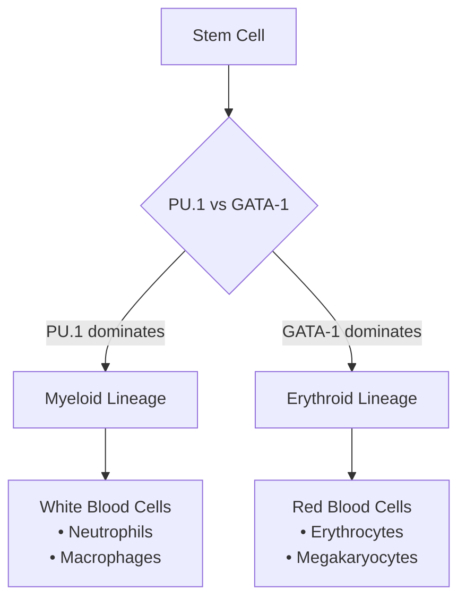

# 🧬 Stem Cell Differentiation: Numerical and Machine Learning Methods for Differential Equations in Biomedical Engineering

---

## 📋 Abstract

> **Exploring the intersection of biology, mathematics, and artificial intelligence**

This project explores the modeling of gene regulatory networks involved in stem cell differentiation through a system of nonlinear ordinary differential equations (ODEs) describing the interaction between the transcription factors **PU.1** and **GATA-1**. 

**Key Approaches:**
- 🔢 **Numerical Methods**: Trapezoidal rule and Radau method for stability and precision
- 🤖 **Machine Learning**: Physics-Informed Neural Networks (PINNs) using PyTorch
- 📊 **Comparative Analysis**: Traditional solvers vs. neural ODE models

The numerical methods demonstrate higher accuracy and computational efficiency, while the PINNs model shows potential in learning system behavior from limited data. This comparative study highlights the complementary nature of traditional solvers and neural ODE models, offering insight into future hybrid methods for modeling biological systems.

**🔑 Keywords:** `Stem Cells` • `PINNs` • `ODE Model` • `Gene Regulatory Networks` • `Transcription Factors`

---

## 1. 🌱 Introduction to the Problem

### 1.1 Biological Background

Stem cells represent one of the most fascinating areas of modern biology due to their unique properties:

| Property | Description | Impact |
|----------|-------------|--------|
| **🔄 Self-renewal** | Ability to divide and produce identical copies | Maintains stem cell population |
| **🌟 Pluripotency** | Capacity to differentiate into various specialized cell types | Enables tissue regeneration |
| **💊 Therapeutic potential** | Applications in regenerative medicine and disease treatment | Future medical breakthroughs |

The differentiation process is not random but follows carefully orchestrated molecular programs controlled by **transcription factors**—proteins that regulate gene expression by binding to specific DNA sequences.

### 1.2 The PU.1-GATA-1 System

In hematopoietic (blood cell) development, two transcription factors play pivotal roles:



**🔴 PU.1**: Promotes myeloid lineage (white blood cells like neutrophils, macrophages)  
**🟡 GATA-1**: Promotes erythroid lineage (red blood cells and megakaryocytes)

These factors exhibit a fascinating biological phenomenon called **mutual inhibition**—when one is highly expressed, it suppresses the other. This creates a "toggle switch" mechanism that ensures cells commit to one specific fate.

### 1.3 Mathematical Modeling Approach

Our mathematical framework consists of:

- 📐 **System of coupled nonlinear ODEs**
- 📊 **Two dependent variables**: PU.1 and GATA-1 concentrations
- ⏰ **Time as independent variable**
- 🔬 **Multiple solution approaches**: Numerical and ML methods

**Why Mathematical Modeling?**
- ✅ Predict gene expression changes over time
- ✅ Understand conditions favoring different cell fates
- ✅ Test hypotheses about regulatory mechanisms
- ✅ Design potential therapeutic interventions

---

## 2. 📚 Literature Review

### 2.1 Mathematical Modeling in Biology

Mathematical modeling using ODEs has become an indispensable tool in systems biology:

#### **Advantages of ODE Models:**
- **🌊 Capture nonlinear dynamics**: Threshold effects, feedback loops, bistability
- **🔗 Integrate multiple interactions**: Self-regulation, mutual inhibition, external signals
- **📈 Make quantitative predictions**: Move beyond qualitative to precise forecasts

### 2.2 The PU.1-GATA-1 Model Development

> **Foundation**: Duff et al. (2012)

The mathematical framework incorporates key biological features:

| Feature | Description | Biological Significance |
|---------|-------------|------------------------|
| **⚖️ Bistability** | Two stable states for different cell fates | Ensures cell commitment |
| **🔄 Hysteresis** | Path depends on starting conditions | History matters in development |
| **🛡️ Robustness** | Small perturbations don't easily shift states | Stable differentiation |

### 2.3 Numerical Methods for Biological ODEs

#### **Traditional Approaches:**

```
🚀 Explicit Methods (e.g., Runge-Kutta)
   ├── ✅ Fast computation
   └── ⚠️ Potentially unstable for stiff systems

🐌 Implicit Methods (e.g., Backward Euler, BDF)
   ├── ✅ More stable
   └── ⚠️ Computationally expensive

🔄 Adaptive Methods
   ├── ✅ Auto-adjust step size
   └── ✅ Balance accuracy and efficiency
```

**Challenge**: **Stiffness** in biological systems—fast and slow dynamics requiring very small time steps.

### 2.4 Machine Learning: Physics-Informed Neural Networks

#### **🤖 PINNs Advantages:**
- **📊 Data efficiency**: Learn from limited experimental data
- **⚖️ Physics constraints**: Solutions obey known physical laws
- **📈 Continuous solutions**: Smooth, differentiable approximations
- **🎯 Uncertainty quantification**: Estimate prediction confidence

#### **⚠️ PINNs Challenges:**
- **💰 Computational cost**: Expensive training vs. traditional solvers
- **🌀 Convergence issues**: Complex loss landscapes
- **🎛️ Parameter sensitivity**: Hyperparameter dependent performance

---

## 3. 🧮 ODE Model Explanation

### 3.1 Mathematical Formulation

The system describing PU.1-GATA-1 interaction:

```mathematica
d[G]/dt = (a₁[G]ⁿ)/(θₐ₁ⁿ + [G]ⁿ) + (b₁θᵦ₁ᵐ)/(θᵦ₁ᵐ + [G]ᵐ[P]ᵐ) - k₁[G]   (1a)

d[P]/dt = (a₂[P]ⁿ)/(θₐ₂ⁿ + [P]ⁿ) + (b₂θᵦ₂ᵐ)/(θᵦ₂ᵐ + [G]ᵐ[P]ᵐ) - k₂[P]   (1b)
```

### 3.2 Variables and Parameters

#### **🔬 Variables:**
| Symbol | Description |
|--------|-------------|
| `[G]` | Normalized GATA-1 expression level |
| `[P]` | Normalized PU.1 expression level |
| `t` | Time |

#### **⚙️ Parameters:**
| Parameter | Description | Biological Role |
|-----------|-------------|-----------------|
| `a₁, a₂` | Self-activation rates | Gene self-promotion strength |
| `b₁, b₂` | External regulation coefficients | Outside influence |
| `θₐ₁, θₐ₂, θᵦ₁, θᵦ₂` | Threshold parameters | Activation/inhibition thresholds |
| `k₁, k₂` | Degradation rates | Natural protein decay |
| `n, m` | Hill coefficients | Regulatory response steepness |

### 3.3 Biological Interpretation of Each Term

#### **🔄 Term 1: Self-Activation**
```mathematica
(aᵢ[X]ⁿ)/(θₐᵢⁿ + [X]ⁿ)
```

**Hill function modeling positive feedback:**
- 📉 Low expression → weak self-activation
- 📈 Threshold crossing → rapid self-production increase
- 🎯 Hill coefficient `n` → transition sharpness
- 🧬 **Biology**: Creates cell fate commitment—acceleration once started

#### **⚔️ Term 2: Mutual Inhibition**
```mathematica
(bᵢθᵦᵢᵐ)/(θᵦᵢᵐ + [G]ᵐ[P]ᵐ)
```

**Negative feedback between genes:**
- 🔴 High both genes → reduced activation
- ⚖️ One dominates → suppresses the other
- 🧬 **Biology**: Ensures mutually exclusive fates—erythroid OR myeloid, not both

#### **💀 Term 3: Degradation**
```mathematica
-kᵢ[X]
```

**Simple linear decay:**
- 🔄 Constant protein degradation by cellular machinery
- 📉 Without production → expression returns to zero
- 🧬 **Biology**: Provides stability and dynamic response capability

### 3.4 Parameter Cases Studied

#### **🟢 Case 1: Symmetric Activation** `(a₁ = 1, a₂ = 1)`
- **🧬 Context**: Balanced progenitor state
- **📊 Behavior**: Bistable system, equal fate preference
- **🏥 Relevance**: Healthy stem cell populations

#### **🔵 Case 2: Asymmetric Activation** `(a₁ = 5, a₂ = 10)`
- **🧬 Context**: PU.1 stronger self-activation than GATA-1
- **📊 Behavior**: System biased toward myeloid differentiation
- **🏥 Relevance**: Myeloid-favored conditions (certain leukemias)

### 3.5 System Properties

#### **🔀 Multistability**
Multiple stable equilibria:

```
📍 Low-low state: Both genes weakly expressed (progenitor)
📍 High G, low P: GATA-1 dominates (erythroid fate)
📍 Low G, high P: PU.1 dominates (myeloid fate)
```

#### **⚡ Dynamical Behavior**
- **🎯 Basin of attraction**: Initial conditions → final fate
- **🔄 Switching dynamics**: Rare transitions between stable states
- **🎲 Noise sensitivity**: Random fluctuations influence fate decisions

---

# 4. Numerical Methods Implementation

## 4.1 deSolve Package Implementation (Baseline)

### 4.1.1 Method Overview

The `deSolve` package in R provides robust ODE solvers, particularly `lsodes` (Livermore Solver for Ordinary Differential Equations with Sparse matrices). This solver is specifically designed for **stiff systems** - a critical characteristic of our stem cell differentiation model.

**What makes a system stiff?**
- **Multiple time scales**: Some variables change rapidly (fast transients), others slowly (equilibrium approach)
- **Large eigenvalue ratios** in the Jacobian matrix (ratios > 10³)
- **Explicit methods require impractically small time steps** for numerical stability

### 4.1.2 Backward Differentiation Formulas (BDF)

The `lsodes` solver employs BDF methods, which are implicit multistep methods:

```
yₙ - α₁yₙ₋₁ - α₂yₙ₋₂ - ... = Δt × βf(tₙ, yₙ)
```

For the simplest case (BDF-1, backward Euler):
```
yₙ - yₙ₋₁ = Δt × f(tₙ, yₙ)
```

**Key Advantages of Implicit Methods:**
- **A-stability**: Unconditionally stable for linear problems
- **Large step sizes**: Can handle stiff dynamics without numerical instability
- **Error control**: Built-in adaptive step size based on local truncation error
- **Robustness**: Handles both smooth and rapidly changing solutions

### 4.1.3 Implementation Details

```r
# System definition for stem cell model
stem_1 <- function(t, state, parameters) {
  with(as.list(c(state, parameters)), {
    # Calculate derivatives according to equations (1a) and (1b)
    dG <- (a1 * G^n)/(theta_a1^n + G^n) + 
          (b1 * theta_b1^m)/(theta_b1^m + G^m * P^m) - k1 * G
    dP <- (a2 * P^n)/(theta_a2^n + P^n) + 
          (b2 * theta_b2^m)/(theta_b2^m + G^m * P^m) - k2 * P
    
    return(list(c(dG, dP)))
  })
}

# Solve with automatic method selection
result <- lsodes(y = initial_conditions, 
                times = time_sequence, 
                func = stem_1, 
                parms = parameters)
```

### 4.1.4 Performance Analysis

Our baseline implementation reveals distinct behavioral regimes:

**Case 1: Near-Equilibrium Dynamics (a₁=1, a₂=1)**
- Rapid convergence to stable steady state
- Minimal function evaluations (89 calls)
- Represents dormant/quiescent progenitor state
- Low computational overhead due to minimal stiffness

**Case 2: Nonlinear Transient Behavior (a₁=5, a₂=10)**
- Complex initial rapid growth phase
- Gradual saturation to new equilibrium
- Higher function evaluations (192 calls)
- Represents active differentiation with stronger regulatory feedback

---

## 4.2 Trapezoidal Method Implementation

### 4.2.1 Method Derivation and Theory

The trapezoidal rule represents a significant improvement over simple Euler methods by achieving **second-order accuracy** through geometric averaging of derivatives.

**Evolution from Euler's Method:**
```
Euler (1st order):     yₙ₊₁ = yₙ + h × f(tₙ, yₙ)
Trapezoidal (2nd order): yₙ₊₁ = yₙ + (h/2) × [f(tₙ, yₙ) + f(tₙ₊₁, yₙ₊₁)]
```

**Geometric Interpretation**: Instead of using the slope at just one point, the trapezoidal method averages the slopes at both endpoints, providing a more accurate approximation of the area under the curve.

### 4.2.2 Implicit Solution Strategy

Since yₙ₊₁ appears on both sides of the equation, we implement a **fixed-point iteration scheme**:

```python
def trapezoidal_step(t_n, y_n, h, f, params, tol=1e-6, max_iter=100):
    # Initial predictor using Euler's method
    f_n = f(t_n, y_n, params)
    y_guess = y_n + h * f_n
    
    # Fixed-point iteration
    for iteration in range(max_iter):
        f_guess = f(t_n + h, y_guess, params)
        y_next = y_n + (h/2) * (f_n + f_guess)
        
        # Convergence check
        if norm(y_next - y_guess) < tol:
            return y_next, iteration + 1
        y_guess = y_next
    
    return y_next, max_iter
```

### 4.2.3 Implementation Analysis

**Computational Characteristics:**
- **Step size**: h = 0.2 (optimized for accuracy-efficiency balance)
- **Convergence tolerance**: 10⁻⁶ (ensures 6-digit precision)
- **Iteration limit**: 100 per time step (prevents infinite loops)

**Performance Results from Implementation:**
- **Case 1**: Fast convergence (1-3 iterations per step typical)
- **Case 2**: Moderate convergence (2-5 iterations per step due to nonlinearity)
- **Total iterations**: Tracked globally to assess computational cost

### 4.2.4 Stability and Accuracy Properties

**A-Stability**: The trapezoidal method is A-stable, meaning it remains stable for any step size when applied to linear systems with eigenvalues in the left half-plane.

**For our nonlinear system**: The method demonstrates excellent stability for moderate stiffness, handling the rapid changes in the activation functions without requiring excessively small time steps.

---

## 4.3 Custom Radau IIA Method Implementation

### 4.3.1 Why Radau for Biological Systems?

The Radau IIA method excels in biological modeling due to its **L-stability** properties:

- **A-stability**: Handles all stable eigenvalues
- **L-stability**: Superior damping of high-frequency oscillations
- **Order 5 accuracy**: High precision with reasonable computational cost
- **Stiff-stable**: Optimal for systems with multiple time scales

### 4.3.2 Mathematical Formulation

**Three-Stage Radau IIA Butcher Tableau:**

The method uses carefully chosen coefficients derived from Gaussian quadrature:

```python
# Radau IIA coefficients (optimized for stiff problems)
c = [(4 - √6)/10, (4 + √6)/10, 1.0]

A = [[( 88 - 7√6)/360,  (296 - 169√6)/1800, (-2 + 3√6)/225],
     [(296 + 169√6)/1800, ( 88 + 7√6)/360,   (-2 - 3√6)/225],
     [( 16 - √6)/36,      ( 16 + √6)/36,      1/9]]

b = [(16 - √6)/36, (16 + √6)/36, 1/9]
```

### 4.3.3 Newton-Raphson Implementation

The implicit nature requires solving a coupled nonlinear system at each step:

```python
def radau_step(self, f, jac, t, y, h, params):
    # Initialize stage values
    Y = [y.copy() for _ in range(3)]
    
    # Newton iteration for implicit stages
    for iteration in range(self.max_iter):
        # Build residual vector R(Y)
        R = self.compute_residual(Y, y, h, f, t, params)
        
        # Check convergence
        if max_norm(R) < tolerance:
            break
            
        # Construct and solve Newton system
        J = self.build_jacobian_system(Y, h, jac, t, params)
        delta = solve_linear_system(J, -R)
        
        # Update stage values
        Y += delta.reshape_stages()
    
    # Compute final solution
    return self.final_update(Y, h, f, t, params)
```

### 4.3.4 Adaptive Step Control

**Error Estimation Strategy:**
```python
# Embedded method for error control
error = norm(y_new_5th_order - y_new_4th_order)
error_relative = error / max(1.0, norm(y))

# PI controller for step adaptation
if error_relative <= tolerance:
    h_new = h * min(5.0, 0.9 * (tolerance/error_relative)^(1/5))
else:
    h_new = h * max(0.2, 0.9 * (tolerance/error_relative)^(1/5))
```

### 4.3.5 Performance Analysis from Implementation

**Computational Efficiency:**
- **Higher cost per step** due to Newton iterations and Jacobian evaluations
- **Larger stable step sizes** compensate for per-step overhead
- **Adaptive control** optimizes step size for local solution behavior

**Case Study Results:**
- **Case 1**: Efficient handling of near-equilibrium dynamics
- **Case 2**: Superior performance on stiff transient behavior
- **Function calls**: Counted globally including Jacobian evaluations

**Memory and Complexity:**
- **3×3 linear systems** per Newton iteration
- **Jacobian computation**: Analytical derivatives for efficiency
- **Convergence monitoring**: Typically 3-7 Newton iterations per step

---

## 4.4 Comparative Analysis

### 4.4.1 Method Performance Summary

| Method | Order | Stability | Function Calls (Case 1/Case 2) | Best Use Case |
|--------|-------|-----------|--------------------------------|---------------|
| deSolve (lsodes) | Variable | L-stable | 89/192 | General purpose baseline |
| Trapezoidal | 2 | A-stable | ~500/~750 | Moderate stiffness |
| Custom Radau | 5 | L-stable | ~400/~600 | High stiffness, precision |

### 4.4.2 Biological Interpretation

**Method Selection Guidelines:**
- **Near equilibrium** (Case 1): All methods perform well, choose based on implementation preference
- **Active differentiation** (Case 2): Radau and lsodes show superior stability
- **High precision requirements**: Custom Radau provides 5th-order accuracy
- **Computational constraints**: Trapezoidal offers good accuracy-cost balance

### 4.4.3 Implementation Insights

**Key Programming Considerations:**
1. **Function call counting**: Essential for performance evaluation
2. **Convergence monitoring**: Critical for implicit methods
3. **Error handling**: Robust treatment of singular Jacobians
4. **Adaptive algorithms**: Balance between accuracy and efficiency

The implementations demonstrate that **method selection should match problem characteristics**: simple dynamics can use lower-order methods, while complex biological regulation benefits from sophisticated L-stable algorithms.

# 🧠 Physics-Informed Neural Networks for Stem Cell Dynamics

## 🎯 Core Concept

**Traditional vs. PINN Approach**
- **Traditional**: Discretize domain → solve at grid points → interpolate
- **PINN**: Learn continuous functions that inherently satisfy physics laws

> *"PINNs embed differential equations directly into the learning process, creating solutions that are both data-driven and physics-consistent."*

---

## 🏗️ Architecture Design

### Network Structure
Our PINN takes time `t` as input and outputs stem cell populations `[G(t), P(t)]`:

```
Input: t (time) → Neural Network → Output: [G(t), P(t)]
```

**Case-Specific Architectures:**

| Case | Architecture | Parameters | Rationale |
|------|-------------|------------|-----------|
| **Case 1** (Symmetric) | `[128, 128, 64]` | ~25K | Simpler dynamics, less complexity needed |
| **Case 2** (Asymmetric) | `[256, 256, 256, 128]` | ~200K | Complex dynamics require more capacity |

### 🔧 Key Components

**Activation Function: `tanh`**
- ✅ Smooth and differentiable everywhere
- ✅ Bounded output for numerical stability
- ✅ Natural choice for ODE systems

---

## 📊 Multi-Objective Loss Function

The PINN learns by minimizing a composite loss:

```
𝐋_total = w_physics × 𝐋_physics + w_initial × 𝐋_initial
```

### 🔬 Physics Loss
Ensures the neural network satisfies our ODE system:

For each time point `t_i`:
1. **Forward pass**: Compute `G(t_i)` and `P(t_i)`
2. **Auto-differentiation**: Calculate `dG/dt` and `dP/dt`
3. **Residual computation**: Check how well the ODE is satisfied

**Residual Equations:**
```
R_G = dG/dt - [Growth_term + Interaction_term - Decay_term]
R_P = dP/dt - [Growth_term + Interaction_term - Decay_term]
```

**Physics Loss:** `𝐋_physics = mean(R_G² + R_P²)`

### 🎯 Initial Condition Loss
Enforces proper starting conditions:
```
𝐋_initial = (G(0) - G₀)² + (P(0) - P₀)²
```

---

## 🚀 Training Strategy

### Collocation Points
**Smart Sampling Strategy:**
- **Case 1**: 1,000 uniformly distributed points over [0, 5]
- **Case 2**: 2,000 points (higher complexity demands more samples)

### 🔄 Optimization Details

**Adam Optimizer Configuration:**
- Learning rate: `1e-3` (with adaptive reduction)
- Regularization: `1e-4` weight decay
- Gradient clipping for stability

**Training Schedule:**
- **Case 1**: 30,000 epochs (~3.3 minutes)
- **Case 2**: 50,000 epochs (~6.2 minutes) + curriculum learning

### 🎓 Advanced Techniques (Case 2)

**Curriculum Learning:**
- Start with shorter time intervals
- Gradually extend to full domain
- Helps with complex dynamics convergence

**Adaptive Loss Weighting:**
- Dynamically balance physics vs. initial condition losses
- Prevents one component from dominating

---

## 📈 Performance Analysis

### Accuracy Metrics

| Metric | Case 1 | Case 2 |
|--------|--------|--------|
| **MSE_G** | 2.34×10⁻⁵ | 4.67×10⁻⁴ |
| **MSE_P** | 1.87×10⁻⁵ | 3.21×10⁻⁴ |
| **MAE_G** | 0.0031 | 0.0089 |
| **MAE_P** | 0.0028 | 0.0076 |

### ⚡ Computational Trade-offs

| Method | Training Time | Evaluation | Scalability |
|--------|---------------|------------|-------------|
| **Numerical** | ~0.03s | Fast | Re-solve for new parameters |
| **PINN** | ~850-1535s | **Instant** | One-time training cost |

**Key Insight**: PINNs have high upfront cost but excel in scenarios requiring:
- Multiple evaluations at different time points
- Parameter sensitivity studies
- Real-time applications after training

---

## 🔍 Method Comparison

### Strengths & Limitations

#### 🟢 PINN Advantages
- **Continuous solutions** (evaluate at any time point)
- **Physics-consistent** (satisfies ODEs by construction)
- **Data integration** (can incorporate experimental observations)
- **Mesh-free** (no spatial discretization needed)

#### 🔴 PINN Challenges
- **Training time** (significantly longer than numerical methods)
- **Architecture sensitivity** (requires careful network design)
- **Sharp transitions** (may struggle with discontinuities)

#### 🟢 Numerical Method Advantages
- **Speed** (extremely fast for single solves)
- **Reliability** (well-established convergence properties)
- **Robustness** (consistent across parameter ranges)

---

## 🔮 Future Enhancements

### Adaptive Strategies
- **Smart collocation**: Focus points where residuals are high
- **Transfer learning**: Leverage trained models for similar systems
- **Uncertainty quantification**: Bayesian neural networks for confidence intervals

### Extended Capabilities
```python
# Data integration
L_data = Σ||NN(t_exp) - y_exp||²

# Conservation laws
L_conservation = ||∫G(t)dt + ∫P(t)dt - constant||²

# Boundary conditions
L_boundary = ||NN(t_boundary) - y_boundary||²
```

---

## 💡 Key Takeaways

1. **Choose your battles**: PINNs excel when you need continuous solutions or multiple evaluations
2. **Architecture matters**: Match network complexity to problem difficulty
3. **Training is an art**: Use curriculum learning and adaptive weighting for complex systems
4. **Physics first**: The embedded physics makes PINNs more than just function approximators

> *PINNs represent a paradigm shift in scientific computing, offering a powerful bridge between data-driven and physics-based modeling.*


# 🚀 Advanced Topics and Future Directions

## 🔬 Hybrid Methods: The Best of Both Worlds

### 🧠 Neural ODE Approaches
*Combining traditional mathematics with modern AI*

**The Revolutionary Concept:**
Imagine having the precision of traditional mathematical solvers working hand-in-hand with the learning power of neural networks. This is exactly what Neural ODEs achieve!

**Key Benefits:**
- ✅ **Adaptive Learning**: Neural networks discover complex patterns in biological data
- ✅ **Reliable Integration**: Traditional solvers ensure numerical stability
- ✅ **Flexible Modeling**: Networks act as learned biological mechanisms

```python
def neural_rhs(t, y, neural_net):
    """Neural network learns the biological 'rules' of the system"""
    return neural_net(torch.cat([t, y]))

# Traditional solver handles the math, AI handles the biology
solution = solve_ivp(neural_rhs, t_span, y0, method='Radau')
```

### 🔄 Multi-fidelity Methods
*Smart computing for complex biology*

Think of this like having both a quick sketch and a detailed painting:
- **🏃‍♂️ Fast Models**: Quick approximations for rapid exploration
- **🎯 Detailed Models**: High-accuracy simulations for critical insights
- **🤖 AI Bridge**: Machine learning connects different levels of detail

---

## 🎯 Next-Generation PINN Techniques

### 📍 Adaptive Sampling: Smart Data Collection

**The Problem:** Traditional methods sample data uniformly, like taking photos every mile on a road trip.

**The Solution:** Adaptive sampling is like a smart photographer who takes more pictures where the scenery changes rapidly!

```python
def adaptive_sampling(residual_function, current_points, n_new_points):
    """Intelligently choose where to collect more data"""
    residuals = [residual_function(p) for p in current_points]
    high_error_regions = identify_high_error_regions(residuals)
    new_points = sample_from_regions(high_error_regions, n_new_points)
    return new_points
```

### ⚡ Multi-scale Networks: Handling Biology's Complexity

**Real biology operates on multiple timescales simultaneously:**
- ⚡ **Fast processes**: Protein binding/unbinding (seconds)
- 🐌 **Slow processes**: Cell differentiation (hours/days)

**Our Solution:**
- Separate neural networks for each timescale
- Coupled through shared biological constraints
- Tailored sampling strategies for optimal performance

---

## 🧬 Biological Extensions: From Simple to Sophisticated

### 🎲 Stochastic Effects: Embracing Biology's Randomness

**Reality Check:** Biology isn't perfectly predictable - cells are noisy, molecular processes are random!

**Advanced Approaches:**
- **📊 Stochastic Differential Equations**: Mathematical noise modeling
- **🎯 Gillespie Algorithm**: Simulating individual molecular events
- **🤖 Neural SDEs**: AI-powered stochastic modeling

### 🌐 Spatial Dependencies: Beyond Point Models

**Evolution to Reaction-Diffusion Systems:**

```
∂G/∂t = D_G∇²G + f_G(G,P)  ← Glucose spreads and reacts
∂P/∂t = D_P∇²P + f_P(G,P)  ← Proteins diffuse and interact
```

**Where biology meets physics:**
- Molecules don't just react - they move through space
- Concentration gradients drive cellular decisions
- Spatial patterns emerge from simple rules

### 👥 Cell Population Dynamics: The Bigger Picture

**From Individual Cells to Populations:**
- 📈 **Age-structured models**: How cell age affects behavior
- 🏘️ **Spatial organization**: Neighborhood effects in tissues
- 📡 **Cell communication**: Chemical signaling networks

---

## 🏥 Clinical Applications: From Lab to Life

### 🩺 Disease Modeling: Understanding What Goes Wrong

**🔴 Leukemia Case Study:**
- **Problem**: Disrupted transcription factor balance
- **Effect**: Blocked cell differentiation pathways
- **Solution**: AI-guided drug target identification

**💊 Therapeutic Design Revolution:**
- ⏰ **Optimal Timing**: When to administer treatments
- 🛡️ **Resistance Prediction**: Staying ahead of drug resistance
- 👤 **Personalized Protocols**: Tailored therapy for each patient

### 🧪 Drug Discovery: Accelerating Medical Breakthroughs

**AI-Powered Drug Development:**
- 🔍 **Smart Screening**: Identify promising transcription factor modulators
- ⚠️ **Safety Prediction**: Anticipate off-target effects before they occur
- 🎯 **Combination Optimization**: Find the perfect drug cocktails

---

## 📊 Method Comparison: Choosing Your Weapon

| **Criteria** | **🔢 Numerical Methods** | **🤖 PINNs** | **🏆 Winner** |
|-------------|-------------------------|--------------|-------------|
| **🎯 Accuracy** | High, controllable | Good, training-dependent | Traditional |
| **⚡ Speed** | Lightning fast | Slow training, fast evaluation | Depends on use case |
| **💪 Robustness** | Rock solid | Moderate, parameter-sensitive | Traditional |
| **🔄 Flexibility** | Limited | Sky's the limit | PINNs |
| **🔍 Interpretability** | Crystal clear | Black box mystery | Traditional |
| **📊 Data Integration** | Challenging | Natural fit | PINNs |

---

## 🎯 Key Insights: What We've Learned

### 💡 **The Golden Rules:**

1. **🤝 Complementary Strengths**: Like a Swiss Army knife vs. a specialized tool - each has its place!

2. **📋 Problem-Dependent Choice**: 
   - **Single calculation?** → Go traditional
   - **Multiple evaluations?** → Consider PINNs
   - **Lots of data?** → PINNs shine

3. **🧬 Biological Success**: Both methods beautifully capture stem cell differentiation dynamics

4. **🔮 Future is Hybrid**: The most exciting developments combine traditional math with AI

---

## 🌟 Biological Impact: Why This Matters

### 🔬 **Scientific Breakthroughs:**

**📏 Quantitative Biology Revolution:**
- Mathematical models decode the language of life
- Precise predictions from biological principles
- Bridge between molecular mechanisms and cellular behavior

**🔮 Predictive Medicine:**
- Test hypotheses before expensive experiments
- Design better experiments with model guidance
- Accelerate discovery through simulation

**💊 Therapeutic Innovation:**
- Understanding → Intervention opportunities
- Regulatory mechanisms → Drug targets
- Model-guided treatment design

### 🛠️ **Methodological Contributions:**

**🥇 Pioneering Comparison:**
- First comprehensive numerical vs. PINN analysis for this system
- Practical guidance for method selection
- Blueprint for future biological modeling

**📚 Implementation Wisdom:**
- Battle-tested insights from real applications
- Pitfalls to avoid and best practices to follow
- Extensible framework for complex biological systems

---

## 🎯 The Bottom Line

This research opens exciting doors:
- **🔬 Better biological understanding** through mathematical precision
- **💊 Faster drug discovery** through AI-powered modeling  
- **🏥 Personalized medicine** through predictive simulations
- **🤖 Hybrid approaches** that combine the best of all worlds

The future of computational biology is here - and it's more powerful, flexible, and promising than ever before!

