# 🧬 Stem Cell Differentiation: Numerical and Machine Learning Methods for Differential Equations in Biomedical Engineering

---

## 📋 Abstract

> **Exploring the intersection of biology, mathematics, and artificial intelligence**

This project explores the modeling of gene regulatory networks involved in stem cell differentiation through a system of nonlinear ordinary differential equations (ODEs) describing the interaction between the transcription factors **PU.1** and **GATA-1**. 

**Key Approaches:**
- 🔢 **Numerical Methods**: Trapezoidal rule and Radau method for stability and precision
- 🤖 **Machine Learning**: Physics-Informed Neural Networks (PINNs) using PyTorch
- 📊 **Comparative Analysis**: Traditional solvers vs. neural ODE models

The numerical methods demonstrate higher accuracy and computational efficiency, while the PINNs model shows potential in learning system behavior from limited data. This comparative study highlights the complementary nature of traditional solvers and neural ODE models, offering insight into future hybrid methods for modeling biological systems.

**🔑 Keywords:** `Stem Cells` • `PINNs` • `ODE Model` • `Gene Regulatory Networks` • `Transcription Factors`

---

## 1. 🌱 Introduction to the Problem

### 1.1 Biological Background

Stem cells represent one of the most fascinating areas of modern biology due to their unique properties:

| Property | Description | Impact |
|----------|-------------|--------|
| **🔄 Self-renewal** | Ability to divide and produce identical copies | Maintains stem cell population |
| **🌟 Pluripotency** | Capacity to differentiate into various specialized cell types | Enables tissue regeneration |
| **💊 Therapeutic potential** | Applications in regenerative medicine and disease treatment | Future medical breakthroughs |

The differentiation process is not random but follows carefully orchestrated molecular programs controlled by **transcription factors**—proteins that regulate gene expression by binding to specific DNA sequences.

### 1.2 The PU.1-GATA-1 System

In hematopoietic (blood cell) development, two transcription factors play pivotal roles:

```mermaid
graph TD
    A[Stem Cell] --> B{PU.1 vs GATA-1}
    B -->|PU.1 dominates| C[Myeloid Lineage]
    B -->|GATA-1 dominates| D[Erythroid Lineage]
    C --> E[White Blood Cells<br/>• Neutrophils<br/>• Macrophages]
    D --> F[Red Blood Cells<br/>• Erythrocytes<br/>• Megakaryocytes]
```



**🔴 PU.1**: Promotes myeloid lineage (white blood cells like neutrophils, macrophages)  
**🟡 GATA-1**: Promotes erythroid lineage (red blood cells and megakaryocytes)

These factors exhibit a fascinating biological phenomenon called **mutual inhibition**—when one is highly expressed, it suppresses the other. This creates a "toggle switch" mechanism that ensures cells commit to one specific fate.

### 1.3 Mathematical Modeling Approach

Our mathematical framework consists of:

- 📐 **System of coupled nonlinear ODEs**
- 📊 **Two dependent variables**: PU.1 and GATA-1 concentrations
- ⏰ **Time as independent variable**
- 🔬 **Multiple solution approaches**: Numerical and ML methods

**Why Mathematical Modeling?**
- ✅ Predict gene expression changes over time
- ✅ Understand conditions favoring different cell fates
- ✅ Test hypotheses about regulatory mechanisms
- ✅ Design potential therapeutic interventions

---

## 2. 📚 Literature Review

### 2.1 Mathematical Modeling in Biology

Mathematical modeling using ODEs has become an indispensable tool in systems biology:

#### **Advantages of ODE Models:**
- **🌊 Capture nonlinear dynamics**: Threshold effects, feedback loops, bistability
- **🔗 Integrate multiple interactions**: Self-regulation, mutual inhibition, external signals
- **📈 Make quantitative predictions**: Move beyond qualitative to precise forecasts

### 2.2 The PU.1-GATA-1 Model Development

> **Foundation**: Duff et al. (2012)

The mathematical framework incorporates key biological features:

| Feature | Description | Biological Significance |
|---------|-------------|------------------------|
| **⚖️ Bistability** | Two stable states for different cell fates | Ensures cell commitment |
| **🔄 Hysteresis** | Path depends on starting conditions | History matters in development |
| **🛡️ Robustness** | Small perturbations don't easily shift states | Stable differentiation |

### 2.3 Numerical Methods for Biological ODEs

#### **Traditional Approaches:**

```
🚀 Explicit Methods (e.g., Runge-Kutta)
   ├── ✅ Fast computation
   └── ⚠️ Potentially unstable for stiff systems

🐌 Implicit Methods (e.g., Backward Euler, BDF)
   ├── ✅ More stable
   └── ⚠️ Computationally expensive

🔄 Adaptive Methods
   ├── ✅ Auto-adjust step size
   └── ✅ Balance accuracy and efficiency
```

**Challenge**: **Stiffness** in biological systems—fast and slow dynamics requiring very small time steps.

### 2.4 Machine Learning: Physics-Informed Neural Networks

#### **🤖 PINNs Advantages:**
- **📊 Data efficiency**: Learn from limited experimental data
- **⚖️ Physics constraints**: Solutions obey known physical laws
- **📈 Continuous solutions**: Smooth, differentiable approximations
- **🎯 Uncertainty quantification**: Estimate prediction confidence

#### **⚠️ PINNs Challenges:**
- **💰 Computational cost**: Expensive training vs. traditional solvers
- **🌀 Convergence issues**: Complex loss landscapes
- **🎛️ Parameter sensitivity**: Hyperparameter dependent performance

---

## 3. 🧮 ODE Model Explanation

### 3.1 Mathematical Formulation

The system describing PU.1-GATA-1 interaction:

```mathematica
d[G]/dt = (a₁[G]ⁿ)/(θₐ₁ⁿ + [G]ⁿ) + (b₁θᵦ₁ᵐ)/(θᵦ₁ᵐ + [G]ᵐ[P]ᵐ) - k₁[G]   (1a)

d[P]/dt = (a₂[P]ⁿ)/(θₐ₂ⁿ + [P]ⁿ) + (b₂θᵦ₂ᵐ)/(θᵦ₂ᵐ + [G]ᵐ[P]ᵐ) - k₂[P]   (1b)
```

### 3.2 Variables and Parameters

#### **🔬 Variables:**
| Symbol | Description |
|--------|-------------|
| `[G]` | Normalized GATA-1 expression level |
| `[P]` | Normalized PU.1 expression level |
| `t` | Time |

#### **⚙️ Parameters:**
| Parameter | Description | Biological Role |
|-----------|-------------|-----------------|
| `a₁, a₂` | Self-activation rates | Gene self-promotion strength |
| `b₁, b₂` | External regulation coefficients | Outside influence |
| `θₐ₁, θₐ₂, θᵦ₁, θᵦ₂` | Threshold parameters | Activation/inhibition thresholds |
| `k₁, k₂` | Degradation rates | Natural protein decay |
| `n, m` | Hill coefficients | Regulatory response steepness |

### 3.3 Biological Interpretation of Each Term

#### **🔄 Term 1: Self-Activation**
```mathematica
(aᵢ[X]ⁿ)/(θₐᵢⁿ + [X]ⁿ)
```

**Hill function modeling positive feedback:**
- 📉 Low expression → weak self-activation
- 📈 Threshold crossing → rapid self-production increase
- 🎯 Hill coefficient `n` → transition sharpness
- 🧬 **Biology**: Creates cell fate commitment—acceleration once started

#### **⚔️ Term 2: Mutual Inhibition**
```mathematica
(bᵢθᵦᵢᵐ)/(θᵦᵢᵐ + [G]ᵐ[P]ᵐ)
```

**Negative feedback between genes:**
- 🔴 High both genes → reduced activation
- ⚖️ One dominates → suppresses the other
- 🧬 **Biology**: Ensures mutually exclusive fates—erythroid OR myeloid, not both

#### **💀 Term 3: Degradation**
```mathematica
-kᵢ[X]
```

**Simple linear decay:**
- 🔄 Constant protein degradation by cellular machinery
- 📉 Without production → expression returns to zero
- 🧬 **Biology**: Provides stability and dynamic response capability

### 3.4 Parameter Cases Studied

#### **🟢 Case 1: Symmetric Activation** `(a₁ = 1, a₂ = 1)`
- **🧬 Context**: Balanced progenitor state
- **📊 Behavior**: Bistable system, equal fate preference
- **🏥 Relevance**: Healthy stem cell populations

#### **🔵 Case 2: Asymmetric Activation** `(a₁ = 5, a₂ = 10)`
- **🧬 Context**: PU.1 stronger self-activation than GATA-1
- **📊 Behavior**: System biased toward myeloid differentiation
- **🏥 Relevance**: Myeloid-favored conditions (certain leukemias)

### 3.5 System Properties

#### **🔀 Multistability**
Multiple stable equilibria:

```
📍 Low-low state: Both genes weakly expressed (progenitor)
📍 High G, low P: GATA-1 dominates (erythroid fate)
📍 Low G, high P: PU.1 dominates (myeloid fate)
```

#### **⚡ Dynamical Behavior**
- **🎯 Basin of attraction**: Initial conditions → final fate
- **🔄 Switching dynamics**: Rare transitions between stable states
- **🎲 Noise sensitivity**: Random fluctuations influence fate decisions

---

## 4. Numerical Methods Implementation

### 4.1 deSolve Package Implementation (Baseline)

#### 4.1.1 Method Overview

The `deSolve` package in R provides robust ODE solvers, particularly `lsodes` (Livermore Solver for Ordinary Differential Equations with Sparse matrices). This solver is specifically designed for **stiff systems**.

**What makes a system stiff?**
- Multiple time scales: Some variables change rapidly, others slowly
- Large eigenvalue ratios in the Jacobian matrix
- Explicit methods require impractically small time steps for stability

#### 4.1.2 Backward Differentiation Formulas (BDF)

The `lsodes` solver uses BDF methods, which are implicit:

```
yₙ - yₙ₋₁ = Δt × f(tₙ, yₙ)
```

**Advantages of implicit methods:**
- **Stability**: Can use larger time steps without numerical instability
- **Accuracy**: Better handling of stiff dynamics
- **Adaptivity**: Automatic step size control based on error estimates

#### 4.1.3 Implementation Details

```r
# System definition
stem_1 <- function(t, state, parameters) {
  with(as.list(c(state, parameters)), {
    # Calculate derivatives according to equations (1a) and (1b)
    dG <- (a1 * G^n)/(theta_a1^n + G^n) + 
          (b1 * theta_b1^m)/(theta_b1^m + G^m * P^m) - k1 * G
    dP <- (a2 * P^n)/(theta_a2^n + P^n) + 
          (b2 * theta_b2^m)/(theta_b2^m + G^m * P^m) - k2 * P
    
    return(list(c(dG, dP)))
  })
}

# Solve system
result <- lsodes(y = initial_conditions, 
                times = time_sequence, 
                func = stem_1, 
                parms = parameters)
```

#### 4.1.4 Results Analysis

**Case 1: Near-Equilibrium Dynamics**
- Rapid convergence to stable state
- Minimal function calls (89)
- Represents dormant or balanced progenitor state

**Case 2: Nonlinear Transient Behavior**
- Initial rapid growth phase
- Gradual saturation to new equilibrium
- More function calls (192) due to complex dynamics
- Represents active differentiation process

### 4.2 Trapezoidal Method Implementation

#### 4.2.1 Method Derivation

The trapezoidal rule improves upon Euler's method by using the average of slopes at both ends of the interval:

**Euler's Method (First-order):**
```
yₙ₊₁ = yₙ + h × f(tₙ, yₙ)
```

**Trapezoidal Method (Second-order):**
```
yₙ₊₁ = yₙ + (h/2) × [f(tₙ, yₙ) + f(tₙ₊₁, yₙ₊₁)]
```

#### 4.2.2 Implicit Nature and Fixed-Point Iteration

Since `yₙ₊₁` appears on both sides, we need an iterative approach:

1. **Initial guess**: Use Euler's method for first approximation
   ```
   y⁽⁰⁾ₙ₊₁ = yₙ + h × f(tₙ, yₙ)
   ```

2. **Iteration**: Refine the estimate
   ```
   y⁽ᵏ⁺¹⁾ₙ₊₁ = yₙ + (h/2) × [f(tₙ, yₙ) + f(tₙ₊₁, y⁽ᵏ⁾ₙ₊₁)]
   ```

3. **Convergence check**: Continue until
   ```
   ||y⁽ᵏ⁺¹⁾ₙ₊₁ - y⁽ᵏ⁾ₙ₊₁|| < tolerance
   ```

#### 4.2.3 Implementation Parameters

- **Time step**: h = 0.2 (chosen to balance accuracy and efficiency)
- **Tolerance**: 10⁻⁶ (ensures sufficient precision)
- **Maximum iterations**: 100 per time step (prevents infinite loops)

#### 4.2.4 Performance Analysis

**Computational Efficiency:**
- More function evaluations than explicit methods
- Fewer evaluations than higher-order implicit methods
- Good compromise between accuracy and speed

**Stability Properties:**
- A-stable (unconditionally stable for linear problems)
- Better stability than explicit methods for our nonlinear system
- Can handle moderate stiffness

### 4.3 Radau Method Implementation

#### 4.3.1 Why Radau for Stiff Systems?

The Radau IIA method is particularly well-suited for stiff ODEs because it possesses **L-stability**:
- **A-stability**: Stable for all step sizes in the left half-plane
- **L-stability**: Damping at infinity (handles very stiff components)
- **High order**: Fifth-order accuracy with three stages

#### 4.3.2 Radau IIA Formulation

The method uses three stages with specific coefficients from the Butcher tableau:

```
Stage equations:
Y₁ = yₙ + h × Σ(a₁ⱼ × f(tₙ + cⱼh, Yⱼ))
Y₂ = yₙ + h × Σ(a₂ⱼ × f(tₙ + cⱼh, Yⱼ))  
Y₃ = yₙ + h × Σ(a₃ⱼ × f(tₙ + cⱼh, Yⱼ))

Final update:
yₙ₊₁ = yₙ + h × Σ(bⱼ × f(tₙ + cⱼh, Yⱼ))
```

#### 4.3.3 Newton-Raphson Solution

Since the stages are coupled, we solve the nonlinear system using Newton's method:

1. **Linearization**: Compute Jacobian matrix
2. **Linear solve**: Find correction vector
3. **Update**: Apply correction to stage values
4. **Iterate**: Until convergence

#### 4.3.4 Adaptive Step Size Control

The method includes error estimation and step size adaptation:

```
Error estimate: ||yₙ₊₁⁽⁵⁾ - yₙ₊₁⁽⁴⁾||

New step size: hₙₑw = h × (tolerance/error)^(1/5)
```

#### 4.3.5 Performance Characteristics

**Advantages:**
- Excellent stability for stiff problems
- High accuracy (fifth-order)
- Robust error control
- Proven performance on biological systems

**Computational Cost:**
- Higher cost per step due to Newton iterations
- Offset by ability to take larger steps
- Most efficient for truly stiff problems

---

# 🧠 Physics-Informed Neural Networks for Stem Cell Dynamics

## 🎯 Core Concept

**Traditional vs. PINN Approach**
- **Traditional**: Discretize domain → solve at grid points → interpolate
- **PINN**: Learn continuous functions that inherently satisfy physics laws

> *"PINNs embed differential equations directly into the learning process, creating solutions that are both data-driven and physics-consistent."*

---

## 🏗️ Architecture Design

### Network Structure
Our PINN takes time `t` as input and outputs stem cell populations `[G(t), P(t)]`:

```
Input: t (time) → Neural Network → Output: [G(t), P(t)]
```

**Case-Specific Architectures:**

| Case | Architecture | Parameters | Rationale |
|------|-------------|------------|-----------|
| **Case 1** (Symmetric) | `[128, 128, 64]` | ~25K | Simpler dynamics, less complexity needed |
| **Case 2** (Asymmetric) | `[256, 256, 256, 128]` | ~200K | Complex dynamics require more capacity |

### 🔧 Key Components

**Activation Function: `tanh`**
- ✅ Smooth and differentiable everywhere
- ✅ Bounded output for numerical stability
- ✅ Natural choice for ODE systems

---

## 📊 Multi-Objective Loss Function

The PINN learns by minimizing a composite loss:

```
𝐋_total = w_physics × 𝐋_physics + w_initial × 𝐋_initial
```

### 🔬 Physics Loss
Ensures the neural network satisfies our ODE system:

For each time point `t_i`:
1. **Forward pass**: Compute `G(t_i)` and `P(t_i)`
2. **Auto-differentiation**: Calculate `dG/dt` and `dP/dt`
3. **Residual computation**: Check how well the ODE is satisfied

**Residual Equations:**
```
R_G = dG/dt - [Growth_term + Interaction_term - Decay_term]
R_P = dP/dt - [Growth_term + Interaction_term - Decay_term]
```

**Physics Loss:** `𝐋_physics = mean(R_G² + R_P²)`

### 🎯 Initial Condition Loss
Enforces proper starting conditions:
```
𝐋_initial = (G(0) - G₀)² + (P(0) - P₀)²
```

---

## 🚀 Training Strategy

### Collocation Points
**Smart Sampling Strategy:**
- **Case 1**: 1,000 uniformly distributed points over [0, 5]
- **Case 2**: 2,000 points (higher complexity demands more samples)

### 🔄 Optimization Details

**Adam Optimizer Configuration:**
- Learning rate: `1e-3` (with adaptive reduction)
- Regularization: `1e-4` weight decay
- Gradient clipping for stability

**Training Schedule:**
- **Case 1**: 30,000 epochs (~3.3 minutes)
- **Case 2**: 50,000 epochs (~6.2 minutes) + curriculum learning

### 🎓 Advanced Techniques (Case 2)

**Curriculum Learning:**
- Start with shorter time intervals
- Gradually extend to full domain
- Helps with complex dynamics convergence

**Adaptive Loss Weighting:**
- Dynamically balance physics vs. initial condition losses
- Prevents one component from dominating

---

## 📈 Performance Analysis

### Accuracy Metrics

| Metric | Case 1 | Case 2 |
|--------|--------|--------|
| **MSE_G** | 2.34×10⁻⁵ | 4.67×10⁻⁴ |
| **MSE_P** | 1.87×10⁻⁵ | 3.21×10⁻⁴ |
| **MAE_G** | 0.0031 | 0.0089 |
| **MAE_P** | 0.0028 | 0.0076 |

### ⚡ Computational Trade-offs

| Method | Training Time | Evaluation | Scalability |
|--------|---------------|------------|-------------|
| **Numerical** | ~0.03s | Fast | Re-solve for new parameters |
| **PINN** | ~850-1535s | **Instant** | One-time training cost |

**Key Insight**: PINNs have high upfront cost but excel in scenarios requiring:
- Multiple evaluations at different time points
- Parameter sensitivity studies
- Real-time applications after training

---

## 🔍 Method Comparison

### Strengths & Limitations

#### 🟢 PINN Advantages
- **Continuous solutions** (evaluate at any time point)
- **Physics-consistent** (satisfies ODEs by construction)
- **Data integration** (can incorporate experimental observations)
- **Mesh-free** (no spatial discretization needed)

#### 🔴 PINN Challenges
- **Training time** (significantly longer than numerical methods)
- **Architecture sensitivity** (requires careful network design)
- **Sharp transitions** (may struggle with discontinuities)

#### 🟢 Numerical Method Advantages
- **Speed** (extremely fast for single solves)
- **Reliability** (well-established convergence properties)
- **Robustness** (consistent across parameter ranges)

---

## 🔮 Future Enhancements

### Adaptive Strategies
- **Smart collocation**: Focus points where residuals are high
- **Transfer learning**: Leverage trained models for similar systems
- **Uncertainty quantification**: Bayesian neural networks for confidence intervals

### Extended Capabilities
```python
# Data integration
L_data = Σ||NN(t_exp) - y_exp||²

# Conservation laws
L_conservation = ||∫G(t)dt + ∫P(t)dt - constant||²

# Boundary conditions
L_boundary = ||NN(t_boundary) - y_boundary||²
```

---

## 💡 Key Takeaways

1. **Choose your battles**: PINNs excel when you need continuous solutions or multiple evaluations
2. **Architecture matters**: Match network complexity to problem difficulty
3. **Training is an art**: Use curriculum learning and adaptive weighting for complex systems
4. **Physics first**: The embedded physics makes PINNs more than just function approximators

> *PINNs represent a paradigm shift in scientific computing, offering a powerful bridge between data-driven and physics-based modeling.*


# 🚀 Advanced Topics and Future Directions

## 🔬 Hybrid Methods: The Best of Both Worlds

### 🧠 Neural ODE Approaches
*Combining traditional mathematics with modern AI*

**The Revolutionary Concept:**
Imagine having the precision of traditional mathematical solvers working hand-in-hand with the learning power of neural networks. This is exactly what Neural ODEs achieve!

**Key Benefits:**
- ✅ **Adaptive Learning**: Neural networks discover complex patterns in biological data
- ✅ **Reliable Integration**: Traditional solvers ensure numerical stability
- ✅ **Flexible Modeling**: Networks act as learned biological mechanisms

```python
def neural_rhs(t, y, neural_net):
    """Neural network learns the biological 'rules' of the system"""
    return neural_net(torch.cat([t, y]))

# Traditional solver handles the math, AI handles the biology
solution = solve_ivp(neural_rhs, t_span, y0, method='Radau')
```

### 🔄 Multi-fidelity Methods
*Smart computing for complex biology*

Think of this like having both a quick sketch and a detailed painting:
- **🏃‍♂️ Fast Models**: Quick approximations for rapid exploration
- **🎯 Detailed Models**: High-accuracy simulations for critical insights
- **🤖 AI Bridge**: Machine learning connects different levels of detail

---

## 🎯 Next-Generation PINN Techniques

### 📍 Adaptive Sampling: Smart Data Collection

**The Problem:** Traditional methods sample data uniformly, like taking photos every mile on a road trip.

**The Solution:** Adaptive sampling is like a smart photographer who takes more pictures where the scenery changes rapidly!

```python
def adaptive_sampling(residual_function, current_points, n_new_points):
    """Intelligently choose where to collect more data"""
    residuals = [residual_function(p) for p in current_points]
    high_error_regions = identify_high_error_regions(residuals)
    new_points = sample_from_regions(high_error_regions, n_new_points)
    return new_points
```

### ⚡ Multi-scale Networks: Handling Biology's Complexity

**Real biology operates on multiple timescales simultaneously:**
- ⚡ **Fast processes**: Protein binding/unbinding (seconds)
- 🐌 **Slow processes**: Cell differentiation (hours/days)

**Our Solution:**
- Separate neural networks for each timescale
- Coupled through shared biological constraints
- Tailored sampling strategies for optimal performance

---

## 🧬 Biological Extensions: From Simple to Sophisticated

### 🎲 Stochastic Effects: Embracing Biology's Randomness

**Reality Check:** Biology isn't perfectly predictable - cells are noisy, molecular processes are random!

**Advanced Approaches:**
- **📊 Stochastic Differential Equations**: Mathematical noise modeling
- **🎯 Gillespie Algorithm**: Simulating individual molecular events
- **🤖 Neural SDEs**: AI-powered stochastic modeling

### 🌐 Spatial Dependencies: Beyond Point Models

**Evolution to Reaction-Diffusion Systems:**

```
∂G/∂t = D_G∇²G + f_G(G,P)  ← Glucose spreads and reacts
∂P/∂t = D_P∇²P + f_P(G,P)  ← Proteins diffuse and interact
```

**Where biology meets physics:**
- Molecules don't just react - they move through space
- Concentration gradients drive cellular decisions
- Spatial patterns emerge from simple rules

### 👥 Cell Population Dynamics: The Bigger Picture

**From Individual Cells to Populations:**
- 📈 **Age-structured models**: How cell age affects behavior
- 🏘️ **Spatial organization**: Neighborhood effects in tissues
- 📡 **Cell communication**: Chemical signaling networks

---

## 🏥 Clinical Applications: From Lab to Life

### 🩺 Disease Modeling: Understanding What Goes Wrong

**🔴 Leukemia Case Study:**
- **Problem**: Disrupted transcription factor balance
- **Effect**: Blocked cell differentiation pathways
- **Solution**: AI-guided drug target identification

**💊 Therapeutic Design Revolution:**
- ⏰ **Optimal Timing**: When to administer treatments
- 🛡️ **Resistance Prediction**: Staying ahead of drug resistance
- 👤 **Personalized Protocols**: Tailored therapy for each patient

### 🧪 Drug Discovery: Accelerating Medical Breakthroughs

**AI-Powered Drug Development:**
- 🔍 **Smart Screening**: Identify promising transcription factor modulators
- ⚠️ **Safety Prediction**: Anticipate off-target effects before they occur
- 🎯 **Combination Optimization**: Find the perfect drug cocktails

---

## 📊 Method Comparison: Choosing Your Weapon

| **Criteria** | **🔢 Numerical Methods** | **🤖 PINNs** | **🏆 Winner** |
|-------------|-------------------------|--------------|-------------|
| **🎯 Accuracy** | High, controllable | Good, training-dependent | Traditional |
| **⚡ Speed** | Lightning fast | Slow training, fast evaluation | Depends on use case |
| **💪 Robustness** | Rock solid | Moderate, parameter-sensitive | Traditional |
| **🔄 Flexibility** | Limited | Sky's the limit | PINNs |
| **🔍 Interpretability** | Crystal clear | Black box mystery | Traditional |
| **📊 Data Integration** | Challenging | Natural fit | PINNs |

---

## 🎯 Key Insights: What We've Learned

### 💡 **The Golden Rules:**

1. **🤝 Complementary Strengths**: Like a Swiss Army knife vs. a specialized tool - each has its place!

2. **📋 Problem-Dependent Choice**: 
   - **Single calculation?** → Go traditional
   - **Multiple evaluations?** → Consider PINNs
   - **Lots of data?** → PINNs shine

3. **🧬 Biological Success**: Both methods beautifully capture stem cell differentiation dynamics

4. **🔮 Future is Hybrid**: The most exciting developments combine traditional math with AI

---

## 🌟 Biological Impact: Why This Matters

### 🔬 **Scientific Breakthroughs:**

**📏 Quantitative Biology Revolution:**
- Mathematical models decode the language of life
- Precise predictions from biological principles
- Bridge between molecular mechanisms and cellular behavior

**🔮 Predictive Medicine:**
- Test hypotheses before expensive experiments
- Design better experiments with model guidance
- Accelerate discovery through simulation

**💊 Therapeutic Innovation:**
- Understanding → Intervention opportunities
- Regulatory mechanisms → Drug targets
- Model-guided treatment design

### 🛠️ **Methodological Contributions:**

**🥇 Pioneering Comparison:**
- First comprehensive numerical vs. PINN analysis for this system
- Practical guidance for method selection
- Blueprint for future biological modeling

**📚 Implementation Wisdom:**
- Battle-tested insights from real applications
- Pitfalls to avoid and best practices to follow
- Extensible framework for complex biological systems

---

## 🎯 The Bottom Line

This research opens exciting doors:
- **🔬 Better biological understanding** through mathematical precision
- **💊 Faster drug discovery** through AI-powered modeling  
- **🏥 Personalized medicine** through predictive simulations
- **🤖 Hybrid approaches** that combine the best of all worlds

The future of computational biology is here - and it's more powerful, flexible, and promising than ever before!

